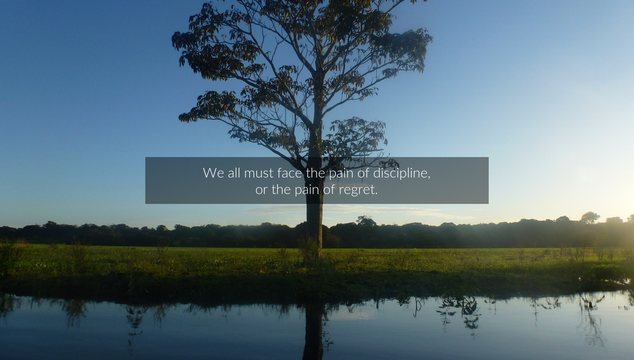

# Background Changer

This tiny script will pick a random image from the `images/` folder, overlay a random quote from `quotes.txt` (use `//` for a forced line break), and set it as your desktop background. For example:

There's also another script for resizing all images that are larger than your screen - it will make switching quicker, and will keep the quote text consistently sized.

Things to note:

- You'll need to enter the path to the script in `update.sh`.
- The script requires ImageMagick.
- The script is set for the font Lato Light - you may wish to change this.
  - You can use `convert -list font` to see your options.
- The resizer is set for a screen that is 1920 pixels wide - you may wish to change this.
- It works with Gnome on Ubuntu - YMMV with other distros.
- This is **not** an actively maintained project; it's a quick and dirty hack I threw together and felt like sharing.
